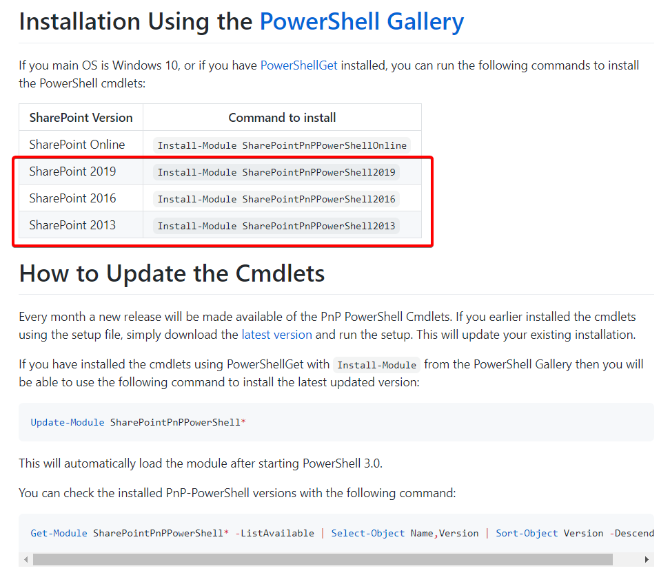
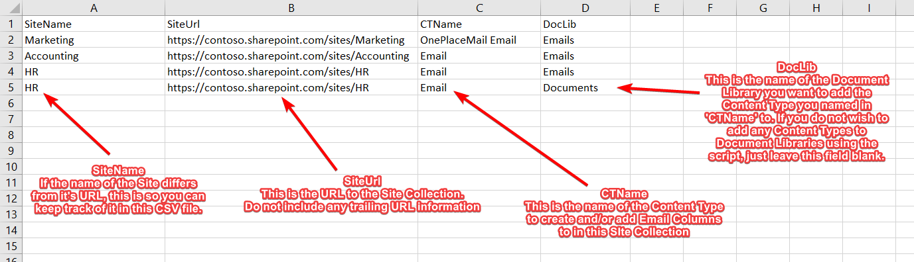
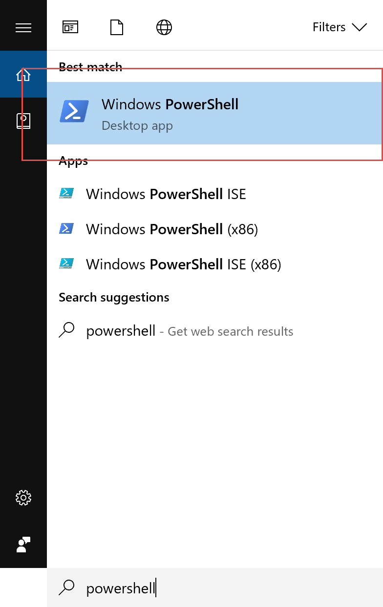
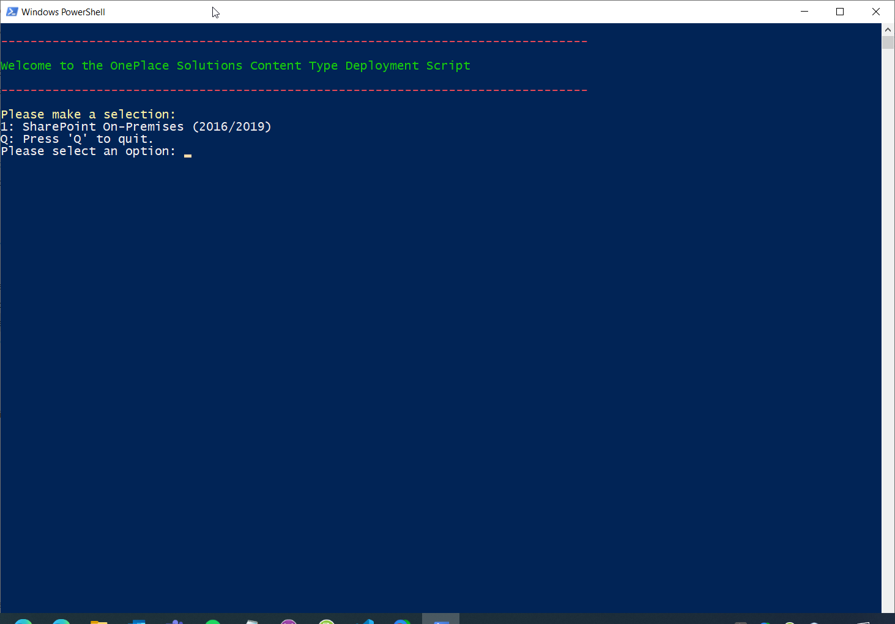
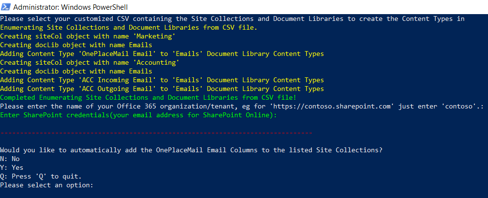
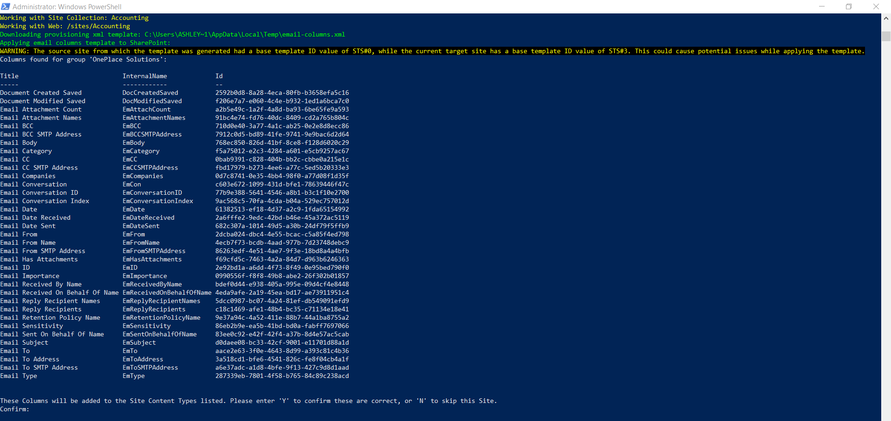
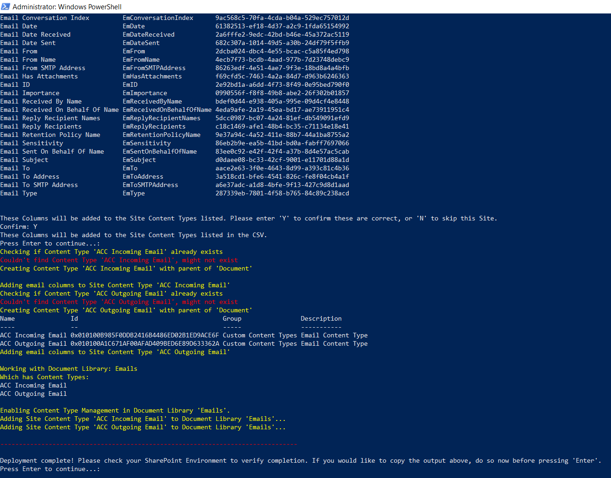

# ContentTypeDeploymentPnP ReadMe

A script and sample CSV file to create the OnePlace Solutions Email Columns, add them to Content Types in listed Site Collections, create the named Content Type(s) where necessary, add them to listed Document Libraries, and create a default Email view.

## Table of Contents

1. [Getting Started](#getting-started)\
    1a. [Pre-Requisites](#pre-requisites)\
    1b. [Assumptions and Considerations](#assumptions-and-considerations)\
4. [SharePoint On-Premise](#sharepoint-on-premise)
5. [License](#license)
6. [Acknowledgments](#acknowledgments)

## Getting Started

Please read the entire README (this page) before using the script to ensure you understand it's prerequisites and considerations/limitations.

Download the 'SitesDocLibs.csv' file ([Right Click this link](https://github.com/OnePlaceSolutions/ContentTypeDeploymentPnP/raw/master/SitesDocLibs.csv) and select 'Save target as' or 'Save link as'), and ensure you save it as a .CSV file. Customize it to your requirements per the notes below, you will be prompted for this file by the script.
If the sample data appears to be in one column in Excel, please try importing the CSV file into Excel via the Data tab instead of opening it directly.
If the script fails to import the contents of the CSV file, please check the CSV file in Notepad to check that the columns appear similar to [this](./SitesDocLibs.csv) and the delimiter is still a comma ','. European formatting in Excel may cause this issue, in which case customize the CSV file in Notepad.

Notes regarding the CSV file:
* The SitesDocLibs.CSV file already contains an example deployment for the 'Contoso' Tenant. If run, it would deploy the Email Content Type 'OnePlaceMail Email' to the 'Emails' Document Library in the 'Marketing' Site Collection, and two Email Content Types to the 'Emails' Document Library in the 'Accounting' Site Collection; 'ACC Incoming Email' and 'ACC Outgoing Email'. If these Content Types do not exist, the script would create them.
* You need a new line for each uniquely named Site Content Type, define which Site Collection it will be created in, and (optionally) which Document Library it will be added to. 
* When listing a subsite/subweb for the 'SiteUrl', the content type will be created in it's parent Site Collection, eg http./<span>contoso.sharepoint.com/sites/**SiteCollection**/SubSite. You can still list a Document Library within that Subsite to have the Site Content Type added to.
* You may use this script for purely Site Column/Content Type creation by omitting any data for the Document Library column.
* Any Site Content Types listed in the CSV that already exist in your SharePoint Environment will have the Email Columns added to it (and preserve the existing columns).
* Built-in Document Libraries must be named as you see them in your user language, eg if the Site is in Norwegian the 'Documents' library is called 'Dokumenter', if your profile is set to English you will see this in the browser as 'Documents' and must use 'Documents' in this script. If your user profile language aligns to the SharePoint Site language then use what is present in SharePoint.

When you have finished customizing the file, please save and close it to ensure the script can correctly read it.

### Pre-Requisites

1.  **(SharePoint On-Premise Only)** [The SharePoint PnP PowerShell cmdlets](https://github.com/pnp/PnP-PowerShell). 
    You will need to install **only the the cmdlets that target your version of SharePoint** on the machine you are running the script from. If you have installed the cmdlets previously using an MSI file these need to be uninstalled from Control Panel, but if you have installed the cmdlets previously using PowerShell Get you can update them with this command:
    ```
    Update-Module SharePointPnPPowerShell<version>
    ```
    
    This is the command pictured to install the PnP Cmdlets via PowerShell Get:
    ```
    Install-Module SharePointPnPPowerShell<version>
    ```
    > 
	

### Technical Assumptions and Considerations

* Content Type(s) to be created will have the Site Content Type 'Document' for it's Parent Content Type. 
* Column group name supplied to the script (when prompted) will have all it's columns added to the Content Type(s). If your current Email Columns exist in a group with other columns, please add them to a new Column group to use with this script
* When using this script to add the Email Columns to an existing Content Type, this existing Content Type must be a Site Content Type, and it may be updated to inherit from the 'Document' Site Content Type in the process.
* Only works with Site Content Types (for both creation and adding Email Columns to existing) inheriting from the 'Document' Site Content Type. These Site Content Types can however still be added to locations within subsites/subwebs.

## SharePoint On-Premise

1. Download the CSV file and modify it to suit your deployment requirements. 

   

2. Start PowerShell (as Administrator) on your machine:
   

3. Run the below command to invoke the current(master) version of the script:

   ```
   Invoke-Expression (New-Object Net.WebClient).DownloadString(‘https://raw.githubusercontent.com/OnePlaceSolutions/ContentTypeDeploymentPnP/master/DeployECTToSitesDoclibs-ONP.ps1’)
   ```
   

4. Select your SharePoint Environment, 1 for SharePoint Online/365, or 2 for SharePoint 2016/2019 On-Premises
   

5. If you would like to automatically create the OnePlaceMail Email Columns in the Site Collections listed in the CSV, you can opt to do so now. Both options will prompt you for the Column Group Name that contains (or will contain) the OnePlaceMail Email Columns. Default name is 'OnePlace Solutions'
   

6. If you would like to automatically create a default Email View in the Document Libraries listed in the CSV, you can also opt to do so now. This will create a default view with the email columns: 'EmDate', 'Name','EmTo', 'EmFrom', 'EmSubject'. Default name is 'OnePlaceMail Emails'.
  

7. Once the email columns have been created or found in your Site Collection(s), you will be prompted to confirm these are the columns you intend to add to the Site Content Types listed in the CSV (and by extension your Document Libraries listed). Type 'Y' and press Enter to continue if they are correct. The pictured example contains all the OnePlaceSolutions Email Columns.
  

8. The script will now add (and create if opted for) the Email Columns to the Email Content Types listed in the CSV, and add those Email Content Types to the Document Libraries listed in the CSV. If you opted for a default Email View to be created, it will also be done now. In this example the script has created the two Content Types listed in the sample CSV, added the Email Columns, and then added those Content Types to the Document Library listed in the sample CSV
  

## License

This project is licensed under the MIT License - see the [LICENSE.md](LICENSE.md) file for details

## Acknowledgments

* Colin Wood for his code example on CSV parsing/iterating, and the original Email Columns deployment script.
